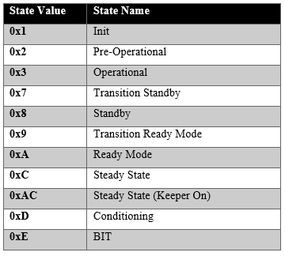
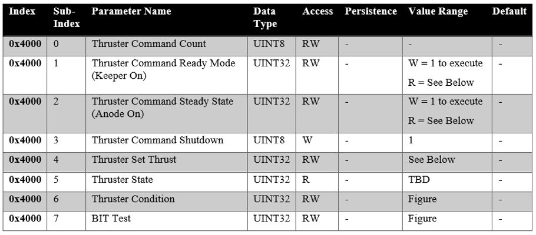
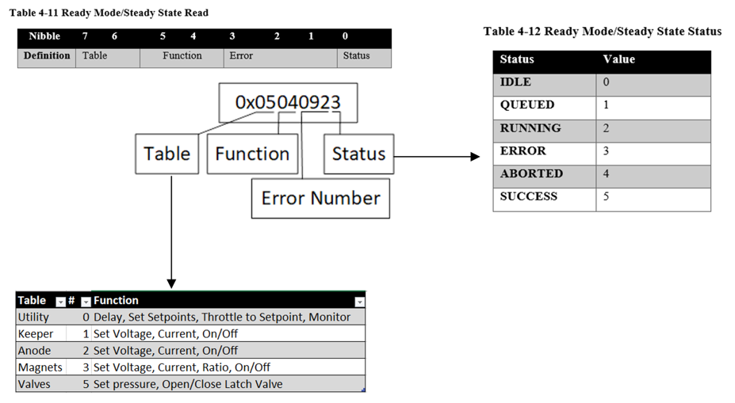
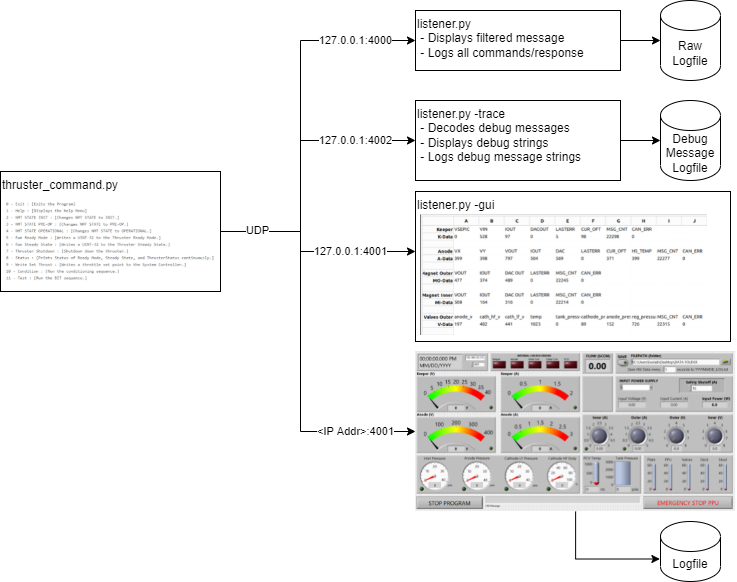
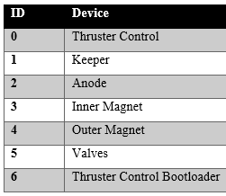

# EXOTERRA System Controller Software Documentation

## Installation and Setup
- Tested on Ubuntu 20.04.2 Python 3.8.5

## Installing git and python3, and supporting packages
```
# ubuntu 20.04.4
sudo ./install.sh
```

## Thruster Command (thruster_command.py).
### Example Usage
```
python3 thruster_command.py 0x22 /dev/ttyUSB0 
============= ExoTerra Thruster Command & Control =============
Found ./conf/default.conf!
Creating logs.
Creating logs/unnamed_test__2022_03_09_14_29_05.
============= ExoTerra Thruster Command Help Menu =============
0 - Exit : [Exits the Program]
1 - Help : [Displays the help Menu]
2 - NMT STATE INIT : [Changes NMT STATE to INIT.]
3 - NMT STATE PRE-OP : [Changes NMT STATE to PRE-OP.]
4 - NMT STATE OPERATIONAL : [Changes NMT STATE to OPERATIONAL.]
5 - Run Ready Mode : [Writes a UINT-32 to the Thruster Ready Mode.]
6 - Run Steady State : [Writes a UINT-32 to the Thruster Steady State.]
7 - Thruster Shutdown : [Shutdown down the thruster.]
8 - Status : [Prints Status of Ready Mode, Steady State, and ThrusterStatus continuously.]
9 - Write Set Thrust : [Writes a throttle set point to the System Controller.]
10 - Condition : [Run the conditioning sequence.]
11 - Test : [Run the BIT sequence.]
12 - Query Block HSI : [Queries the HSI values using a block transfer]
Ready Mode: 0x1020005: Steady State: 0x40005: ThrusterStatus:0x2 Condition Status:0x0 Thrust Point:0x2  Bit Status: 0x0
System Controller Connected!
[rm:0x1020005:ss:0x40005:ts:0x2]>
```

## System Controller Selectable Modes
Mode               | Mode Description  
-------------------|-------------------
2 - NMT STATE INIT           | This state will reset the System Controller back to a default state.
3 - NMT STATE PRE-OPERATIONAL| This state sets the system controller in a low power mode.  This is the default state on power up.
4 - NMT STATE OPERATIONAL    | This state powers on the entire system and enables telemetry.

## Thruster Command Prompt Breakdown

[<*ready mode*>:0:<*steady state*>:0:<***thruster state***>:0]>
```
NMT State INIT
[rm:0:ss:0:ts:2]> 
NMT State PRE-OPERATIONAL
[rm:0:ss:0:ts:7]> 
NMT State OPERATIONAL
[rm:0:ss:0:ts:8]> 
```
*Note - state is refreshed when enter is pressed*

### Thruster States



## Thruster Control Commands
Commands to the system are run shown as below.  The index subindex and value associated with the command are echoed on the screen.

```
[rm:0:ss0:ts:0]> <menu selection> 
{'Wrote:<index>-<subindex>: <value>'}

Example:
Thruster Shutdown
[rm:0:ss:0:ts:8]> 7
{'Wrote:0x4000-0x3: 0x01'}
```
### Thruster Command Table 



## BIT Tests
To run a BIT test make sure the Thruster Control State is Standby, select the bit menu item.  Then when prompted select the bit number you want to run.

The BITs are hard coded as followed:
1. RESERVED 
2. sequence_bit_latch_valve_open 
3. sequence_bit_latch_valve_close
4. sequence_bit_cathode_low_flow_check
5. sequence_bit_anode_valve_check
6. sequence_bit_pcv_drain  
7. sequence_inner_coil_test
8. sequence_outer_coil_test 
9. sequence_keeper_test 
10. sequence_anode_test
```
============= ExoTerra Thruster Command & Control =============
============= ExoTerra Thruster Command Help Menu =============
0 - Exit : [Exits the Program]
1 - Help : [Displays the help Menu]
2 - NMT STATE INIT : [Changes NMT STATE to INIT.]
3 - NMT STATE PRE-OP : [Changes NMT STATE to PRE-OP.]
4 - NMT STATE OPERATIONAL : [Changes NMT STATE to OPERATIONAL.]
5 - Run Ready Mode : [Writes a UINT-32 to the Thruster Ready Mode.]
6 - Run Steady State : [Writes a UINT-32 to the Thruster Steady State.]
7 - Thruster Shutdown : [Shutdown down the thruster.]
8 - Status : [Prints Status of Ready Mode, Steady State, and ThrusterStatus continuously.]
9 - Write Set Thrust : [Writes a throttle set point to the System Controller.]
10 - Condition : [Run the conditioning sequence.]
11 - Test : [Run the BIT sequence.]
2Ready Mode: 0x0: Steady State: 0x0: ThrusterStatus:0x8 Condition Status:0x0 Thrust Point:0x1  Bit Status: 0x1fff5
System Controller Connected!
[rm:0x0:ss:0x0:ts:0x2]> 11
Test
Enter hex value to send to ECP - or 'x' to return to previous menu.
write> 0x3
{'Wrote:0x4000-0x7: 0x03000000'}
8
Status
Ready Mode: 0x0: Steady State: 0x0: ThrusterStatus:0x8 Condition Status:0x0 Thrust Point:0x1  Bit Status: 0x1fff5
```

The most IMPORTANT part is the last digit which shows the status of the BIT running.

## BIT tests can be aborted with menu item 11 and value 0 (write 0 to index - 0x4000, subindex - 0x7).
```
[rm:0x0:ss:0x0:ts:0x8]> 11
Test
Enter hex value to send to ECP - or 'x' to return to previous menu.
write> 0x0
{'Wrote:0x4000-0x7: 0x00000000'}
[rm:0x0:ss:0x0:ts:0xe]> 8
Status
Ready Mode: 0x0: Steady State: 0x0: ThrusterStatus:0x8 Condition Status:0x0 Thrust Point:0x1  Bit Status: 0x1fff4
```
This will result in an aborted code for Bit Status, which is shown by the last digit 4.

## Mode Status
This applies to Ready Mode, Steady State, Conditioning, and BIT modes.  These are read at index 0x4000, subindex 0x1,0x2,0x6, and 0x7 respectively.

Then menu item 8 which updates every second to poll mode statuses.  This status is broken into a few parts as follows.

### Mode Status Breakdown



## The Listener Script (listener.py)
The listener.py script allows for viewing and capturing of raw serial messages, trace, and telemetry messages.
Thruster Command forwards msg traffic over UDP to the listener script on 3 ports, one for raw serial msgs, one for debug messages, and one for telemetry messages.  The UDP ports are 4000, 4002, 4001 respectively.
```
python .\listener.py -h
usage: listener.py [-h] [-trace] [-hsi] [-gui] [-socket SOCKET] [-port PORT]

Listens for exoserial data on the local network (udp).

optional arguments:
  -h, --help      show this help message and exit
  -trace          Enables Trace Mode.
  -hsi            Enables HSI Mode.
  -gui            Enables Gui.
  -socket SOCKET  The Network host to bind to.
  -port PORT      The port to listen on.


#Listening to trace msgs
python .\listener.py -trace

#Listening to hsi msgs
python .\listener.py -hsi

#Listening to hsi msgs with gui
python .\listener.py -gui

#Listening to raw msgs
python .\listener.py 
```

### Script Message Diagram


Msg Type           | Description  
-------------------|-------------------
Trace Msg          | A print message from the system controller for more insight into debugging.
HSI Msg            | A health and status message from the system controller for direct viewing of status and state.
Raw Msg            | These messages are raw serial messages in a structure as shown in the ICD.

## Versions Script (versions.py)
versions.py dumps the firmware from versions from the System Controller and writes them to a local file as well as displays them to the current terminal.  The versions script creates a log file with a timestamp in the local directory every time it runs, with the format shown below.
```
python3 versions.py /dev/ttyUSB0 
Id: Version  :gitsha    :git sha 1 :Exec V 1  :git sha 2 :Exec V 2  :git sha 3 :Exec V 3 
0 : 00010300 : 770c450c : 770c450c : 00010300 : 770c450c : 00010300 : 770c450c : 00010300
1 : 00000101 : 7b4af855 : 7b4af855 : 00000101 : 7b4af855 : 00000101 : 7b4af855 : 00000101
2 : 00000202 : fdf28164 : fdf28164 : 00000202 : fdf28164 : 00000202 : fdf28164 : 00000202
3 : 00000101 : c7430617 : c7430617 : 00000101 : c7430617 : 00000101 : c7430617 : 00000101
4 : 00000101 : c7430617 : c7430617 : 00000101 : c7430617 : 00000101 : c7430617 : 00000101
5 : 00000200 : fbac9d86 : fbac9d86 : 00000200 : fbac9d86 : 00000200 : fbac9d86 : 00000200
6 : 00000100 : 770c450c : 770c450c : 00000100 : 770c450c : 00000100 : 770c450c : 00000100
```

### Version IDs



## Example Script (example.py)
The example script shows how to go from power up to steady state.

Error handling and telemetry have been omitted.

```
$ python3 ./example.py 
Created can Network.
Created Exoserial device.
Created CANOpen Node.
Added 0x22 to canopen Network.
Resetting PPU.
Waiting for boot msg...
PPU Ready!
Transitioning to Standby. Thruster State: 0x8
Thruster State: 0x8
Device is set to Standby.
Transitioning to Ready Mode. Thruster State: 0xa
Thruster State: 0xa
Device is set to Ready Mode. 
Transitioning to Steady State. Thruster State: 0xc
Thruster State: 0xc
Device in Steady State. 0xc
PPU took 21.405359268188477 seconds from reset to steady state.
Thruster in Steady State. Cntrl-c to shutdown and exit.
^C
Detected Cntrl-c Returning to Pre-Operational.
Sent NMT change state Pre-Operational.
```

## Errors and Explanations
Error Code         | Error Description | Possible Solutions
-------------------|------------------|-------------------
Code 0x06010002 | Attempt to write a read only object | Make sure the System Controller is flashed to the correct firmware with versions.py or check to make sure it is in Operational Mode.
Code 0x08000020 | Data cannot be transferred or stored to the application | Make sure the System Controller is in Operational Mode.

version 0.0.7
