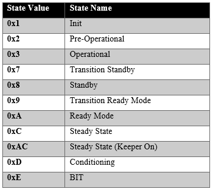
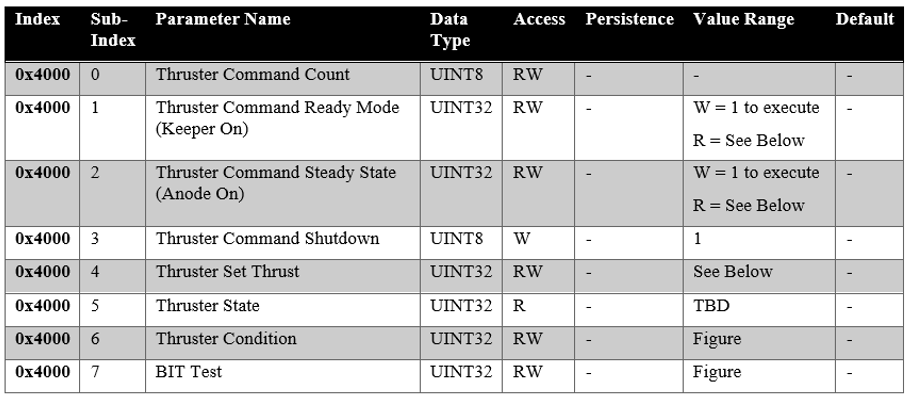
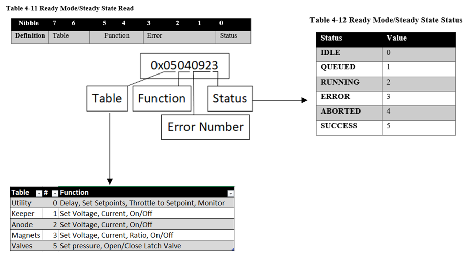
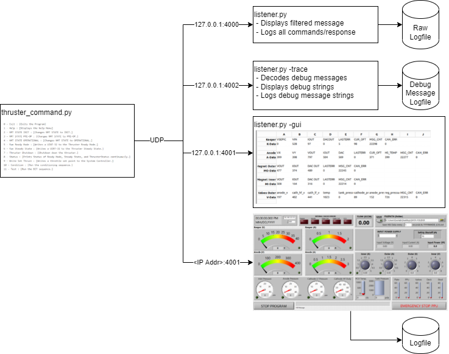
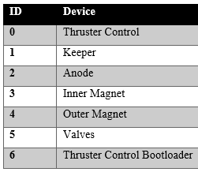

# EXOTERRA System Controller Software Documentation

## Installation and Setup
Tested on Ubuntu 20.04.2 with Python 3.8.5 (also compatible with Ubuntu 22.04 and Python 3.10.12)

## Installing Git, Python3, and Supporting Packages
```
# Ubuntu 20.04.4 or Ubuntu 22.04
sudo ./install.sh
```

## Thruster Command (thruster_command.py)
### Example Usage
```
python3 thruster_command.py /dev/ttyUSB0 0x22 ./obj.eds
============= ExoTerra Thruster Command & Control =============
Found ./conf/default.conf!
Creating logs.
Creating logs/unnamed_test__2022_03_09_14_29_05.
============= ExoTerra Thruster Command Help Menu =============
0 - Exit : [Exits the Program]
1 - Help : [Displays the help Menu]
2 - NMT STATE INIT : [Changes NMT STATE to INIT.]
3 - NMT STATE PRE-OP : [Changes NMT STATE to PRE-OP.]
4 - NMT STATE OPERATIONAL : [Changes NMT STATE to OPERATIONAL.]
5 - Run Ready Mode : [Writes a UINT-32 to the Thruster Ready Mode.]
6 - Run Steady State : [Writes a UINT-32 to the Thruster Steady State.]
7 - Thruster Shutdown : [Shutdown down the thruster.]
8 - Status : [Prints Status of Ready Mode, Steady State, and ThrusterStatus continuously.]
9 - Write Set Thrust : [Writes a throttle set point to the System Controller.]
10 - Condition : [Run the conditioning sequence.]
11 - Test : [Run the BIT sequence.]
12 - Query Block HSI : [Queries the HSI values using a block transfer]
Ready Mode: 0x1020005: Steady State: 0x40005: ThrusterStatus:0x2 Condition Status:0x0 Thrust Point:0x2  Bit Status: 0x0
System Controller Connected!
[rm:0x1020005:ss:0x40005:ts:0x2]>
```
The obj.eds file is something that can be providied on request.  It is necessary to connect to the unit.

## System Controller Selectable Modes
Mode               | Mode Description  
-------------------|-------------------
2 - NMT STATE INIT           | This state will reset the System Controller back to a default state.
3 - NMT STATE PRE-OPERATIONAL| This state sets the system controller in a low power mode.  This is the default state on power up.
4 - NMT STATE OPERATIONAL    | This state powers on the entire system and enables telemetry.

## Thruster Command Prompt Breakdown

[<*ready mode*>:0:<*steady state*>:0:<***thruster state***>:0]>
```
NMT State INIT
[rm:0:ss:0:ts:2]> 
NMT State PRE-OPERATIONAL
[rm:0:ss:0:ts:7]> 
NMT State OPERATIONAL
[rm:0:ss:0:ts:8]> 
```
*Note: State is refreshed when Enter is pressed*

### Thruster States



## Thruster Control Commands
Commands to the system are executed as shown below. The index, subindex, and value associated with each command are displayed on the screen.

```
[rm:0:ss0:ts:0]> <menu selection> 
{'Wrote:<index>-<subindex>: <value>'}

Example:
Thruster Shutdown
[rm:0:ss:0:ts:8]> 7
{'Wrote:0x4000-0x3: 0x01'}
```
### Thruster Command Table 



## BIT Tests
To run a BIT (Built-In Test), ensure the Thruster Control State is in Standby, then select the BIT menu item. When prompted, select the desired BIT test number.

The BITs are hard coded as followed:
0. Cancel BIT Test
1. RESERVED 
2. sequence_bit_latch_valve_open 
3. sequence_bit_latch_valve_close
4. sequence_bit_cathode_low_flow_check
5. sequence_bit_anode_valve_check
6. sequence_bit_pcv_drain  
7. sequence_inner_coil_test
8. sequence_outer_coil_test 
9. sequence_keeper_test 
10. sequence_anode_test
11. sequence_cathode_lf_check_ambient
12. sequence_anode_valve_check_ambient
13. sequence_open_all_valves
```
============= ExoTerra Thruster Command & Control =============
============= ExoTerra Thruster Command Help Menu =============
0 - Exit : [Exits the Program]
1 - Help : [Displays the help Menu]
2 - NMT STATE INIT : [Changes NMT STATE to INIT.]
3 - NMT STATE PRE-OP : [Changes NMT STATE to PRE-OP.]
4 - NMT STATE OPERATIONAL : [Changes NMT STATE to OPERATIONAL.]
5 - Run Ready Mode : [Writes a UINT-32 to the Thruster Ready Mode.]
6 - Run Steady State : [Writes a UINT-32 to the Thruster Steady State.]
7 - Thruster Shutdown : [Shutdown down the thruster.]
8 - Status : [Prints Status of Ready Mode, Steady State, and ThrusterStatus continuously.]
9 - Write Set Thrust : [Writes a throttle set point to the System Controller.]
10 - Condition : [Run the conditioning sequence.]
11 - Test : [Run the BIT sequence.]
12 - Query Block HSI : [Queries the HSI values using a block transfer]
2Ready Mode: 0x0: Steady State: 0x0: ThrusterStatus:0x8 Condition Status:0x0 Thrust Point:0x1  Bit Status: 0x1fff5
System Controller Connected!
[rm:0x0:ss:0x0:ts:0x2]> 11
Test
Enter hex value to send to ECP - or 'x' to return to previous menu.
write> 0x3
{'Wrote:0x4000-0x7: 0x03000000'}
8
Status
Ready Mode: 0x0: Steady State: 0x0: ThrusterStatus:0x8 Condition Status:0x0 Thrust Point:0x1  Bit Status: 0x1fff5
```

The most important information is the last digit, which indicates the status of the running BIT.

### Aborting BIT Tests
BIT tests can be aborted by selecting menu item 11 and entering value 0 (writes 0 to index 0x4000, subindex 0x7).
```
[rm:0x0:ss:0x0:ts:0x8]> 11
Test
Enter hex value to send to ECP - or 'x' to return to previous menu.
write> 0x0
{'Wrote:0x4000-0x7: 0x00000000'}
[rm:0x0:ss:0x0:ts:0xe]> 8
Status
Ready Mode: 0x0: Steady State: 0x0: ThrusterStatus:0x8 Condition Status:0x0 Thrust Point:0x1  Bit Status: 0x1fff4
```
This will result in an aborted status code for BIT Status, indicated by the last digit (4).

## Mode Status
Mode status information applies to Ready Mode, Steady State, Conditioning, and BIT modes. These values are read from index 0x4000 at subindices 0x1, 0x2, 0x6, and 0x7 respectively.

Menu item 8 provides continuous status updates every second to poll mode statuses. The status information is structured as follows:

### Mode Status Breakdown



## Listener Script (listener.py)
The listener.py script provides viewing and capturing functionality for raw serial messages, trace messages, and telemetry data. The Thruster Command script forwards message traffic over UDP to the listener on three separate ports: 4000 for raw serial messages, 4001 for telemetry messages, and 4002 for debug messages.

### Usage
```
python3 listener.py -h
usage: listener.py [-h] [-trace] [-hsi] [-gui] [-socket SOCKET] [-port PORT]

Listens for exoserial data on the local network (udp).

optional arguments:
  -h, --help      show this help message and exit
  -trace          Enables Trace Mode.
  -hsi            Enables HSI Mode.
  -gui            Enables Gui.
  -socket SOCKET  The Network host to bind to.
  -port PORT      The port to listen on.
```

### Examples
```
# Listening to trace msgs
python3 ./listener.py -trace

# Listening to hsi msgs
python3 ./listener.py -hsi

# Listening to hsi msgs with gui
python3 ./listener.py -gui

# Listening to raw msgs
python3 ./listener.py 
```

### Script Message Diagram


### Message Types

Message Type       | Description  
-------------------|-------------------
Trace Message      | Debug print message from the System Controller providing insight for troubleshooting
HSI Message        | Health and Status Interface message containing real-time status and state information
Raw Message        | Raw serial messages following the structure defined in the ICD

## Versions Script (versions.py)
The versions.py script retrieves firmware version information from the System Controller and writes it to a timestamped log file. The script creates a log file in the `./logs/versions/` directory with the format `sw_version_YYYY_MM_DD_HH_MM_SS.txt`.

### Usage
```
python3 versions.py <device> <system_id>
```

### Arguments
- `device`: Serial port device (e.g., `/dev/ttyUSB0`, `COM3`) or `pcan` for PCAN interface
- `system_id`: System identifier in hexadecimal format (typically `0x22`)

### Example
```
python3 versions.py /dev/ttyUSB0 0x22
Id: Version  : gitsha   : git sha 1 : Exec V 1  : git sha 2 : Exec V 2  : git sha 3 : Exec V 3 : Device Name  
0 : 00010300 : 770c450c : 770c450c : 00010300 : 770c450c : 00010300 : 770c450c : 00010300
1 : 00000101 : 7b4af855 : 7b4af855 : 00000101 : 7b4af855 : 00000101 : 7b4af855 : 00000101
2 : 00000202 : fdf28164 : fdf28164 : 00000202 : fdf28164 : 00000202 : fdf28164 : 00000202
3 : 00000101 : c7430617 : c7430617 : 00000101 : c7430617 : 00000101 : c7430617 : 00000101
4 : 00000101 : c7430617 : c7430617 : 00000101 : c7430617 : 00000101 : c7430617 : 00000101
5 : 00000200 : fbac9d86 : fbac9d86 : 00000200 : fbac9d86 : 00000200 : fbac9d86 : 00000200
6 : 00000100 : 770c450c : 770c450c : 00000100 : 770c450c : 00000100 : 770c450c : 00000100
```

## Update Firmware Script (update_firmware.py)
The update_firmware.py script handles firmware updates for the PPU (Power Processing Unit) and EDU (Engine Drive Unit). The script downloads the firmware image to the device, verifies the transfer, and installs the new firmware upon user confirmation.

### Usage
```
python3 update_firmware.py <serial_port> <system_id> <image_file> [--v]
```

### Arguments
- `serial_port`: Serial port device (e.g., `/dev/ttyUSB0`, `COM3`) or `can` for PCAN interface
- `system_id`: System identifier in hexadecimal format (typically `0x22`)
- `image_file`: Path to the firmware binary file (e.g., `1560030207.bin`)

### Options
- `--v`: Skip the download phase and proceed directly to verify and install (useful if download already completed)

### Firmware Update Process
The update process consists of three phases:
1. **Download**: Transfers the firmware image to the device
2. **Verify**: Validates the transferred image integrity
3. **Install**: Flashes the firmware and reboots the device

After verification, the script prompts for user confirmation before installing. Upon successful installation, the device will reboot and the script will wait for the bootup message (NMT message 0x722) to confirm successful operation.

### Example
```
python3 update_firmware.py /dev/ttyUSB0 0x22 1560030207.bin
Updating Firmware.  This will take a few minutes. A y/n install prompt will be shown to finish the install.
...
(approximately 15 minutes later)
install image? y/n $ y
Image Flashed; Waiting for 0x722 NMT msg from PPU.
PPU Booted Successfully.
```

### Version IDs



## Example Script (example.py)
The example.py script demonstrates the complete sequence for powering up and operating the thruster from initialization to steady state. This script serves as a reference implementation with hardcoded parameters.

### Usage
```
python3 ./example.py
```

### Note
This script does not accept command line arguments. Serial port and system ID are hardcoded in the script (defaults: `/dev/ttyUSB0`, `0x22`). Error handling and telemetry have been omitted for clarity.

### Example Output
$ python3 ./example.py 
Created can Network.
Created Exoserial device.
Created CANOpen Node.
Added 0x22 to canopen Network.
Resetting PPU.
Waiting for boot msg...
PPU Ready!
Transitioning to Standby. Thruster State: 0x8
Thruster State: 0x8
Device is set to Standby.
Transitioning to Ready Mode. Thruster State: 0xa
Thruster State: 0xa
Device is set to Ready Mode. 
Transitioning to Steady State. Thruster State: 0xc
Thruster State: 0xc
Device in Steady State. 0xc
PPU took 21.405359268188477 seconds from reset to steady state.
Thruster in Steady State. Press Ctrl-C to shutdown and exit.
^C
Detected Ctrl-C. Returning to Pre-Operational.
Sent NMT change state Pre-Operational.
```

## Error Handling Script (error_handling.py)
The error_handling.py script provides access to error logs, fault handlers, and fault status information from the System Controller.

### Usage
```
python3 error_handling.py <serial_port> <system_id> <eds_file> [--action ACTION] [--debug]
```

### Arguments
- `serial_port`: Serial port device (e.g., `/dev/ttyUSB0`, `COM3`) or `can` for PCAN interface
- `system_id`: System identifier in hexadecimal format (typically `0x22`)
- `eds_file`: Path to the EDS (Electronic Data Sheet) file for communication

### Options
- `--action ACTION`: Specify action for error log dump or fault handler configuration
- `--debug`: Enable debug mode for detailed output

### Available Actions
```
Dump Error Log
Change Fault Handler
Dump Fault Status
Dump Error History
Clear Error History
```

## Calibration Data Editor Script (calibration_data_editor.py)
The calibration_data_editor.py script provides read and write access to calibration offsets and scaling factors for pressure transducers.

### Usage
```
python3 calibration_data_editor.py <serial_port> <system_id> [--action ACTION]
```

### Arguments
- `serial_port`: Serial port device (e.g., `/dev/ttyUSB0`, `COM3`) or `can` for PCAN interface
- `system_id`: System identifier in hexadecimal format (typically `0x22`)

### Options
- `--action ACTION`: Specify action for calibration data operations

### Available Actions
```
Write Transducer Select (0 = Tank, 1 = Regulator, 2 = Cathode, 3 = Anode)
Read Transducer Select
Write Calibration Offset
Read Calibration Offset
Write Calibration Scaling Factor
Read Calibration Scaling Factor
Erase Calibration Data
```
## Parse HSI Script (parse_hsi.py)
The parse_hsi.py script converts binary telemetry log files into human-readable CSV format for analysis.

### Usage
```
python3 parse_hsi.py <input_filename> <output_filename>
```

### Arguments
- `input_filename`: Path to the binary HSI telemetry file
- `output_filename`: Desired path for the output CSV file

## Compress Logs Script (scripts/compress_logs.py)
The compress_logs.py script compresses unarchived log session folders into zip archives for storage cleanup. Each test session writes a timestamped subfolder under `logs/`; this script walks that directory and compresses any folder that does not already have a corresponding `.zip` file. Existing archives are skipped so the script is safe to run repeatedly.

### Usage
```
python3 scripts/compress_logs.py [logs_dir] [--dry-run] [--delete]
```

### Arguments
- `logs_dir`: Path to the logs directory to scan (default: `./logs` relative to the project root)

### Options
- `--dry-run`: Preview which folders would be compressed without making any changes
- `--delete`: Remove the original folder after it is successfully compressed

### Example
```
# Preview what would be compressed
python3 scripts/compress_logs.py --dry-run
Scanning: /path/to/logs
  compress te_2026_08_20_07_10_00 -> te_2026_08_20_07_10_00.zip (4 files)
  ...
Done: 19 compressed, 0 skipped.

# Compress all folders and delete originals
python3 scripts/compress_logs.py --delete
```

### Notes
- Only top-level subfolders are compressed; loose files and existing `.zip` files in the logs directory are ignored
- Archives use ZIP deflate compression at the maximum level (9)
- Internal folder structure is preserved inside each archive

## Errors and Explanations

Error Code     | Error Description                                        | Possible Solutions
---------------|----------------------------------------------------------|-------------------
0x06010002     | Attempt to write a read-only object                      | Verify the System Controller firmware is correct using versions.py and ensure the device is in Operational Mode
0x08000020     | Data cannot be transferred or stored to the application  | Ensure the System Controller is in Operational Mode

version 0.0.7
